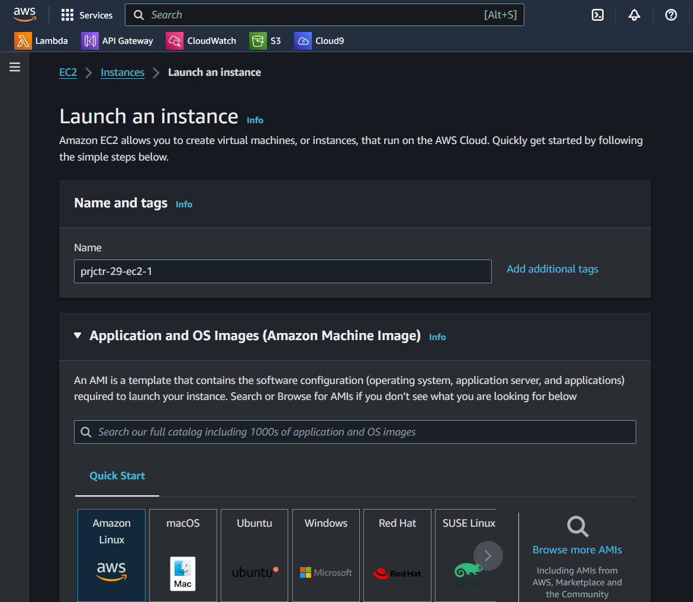
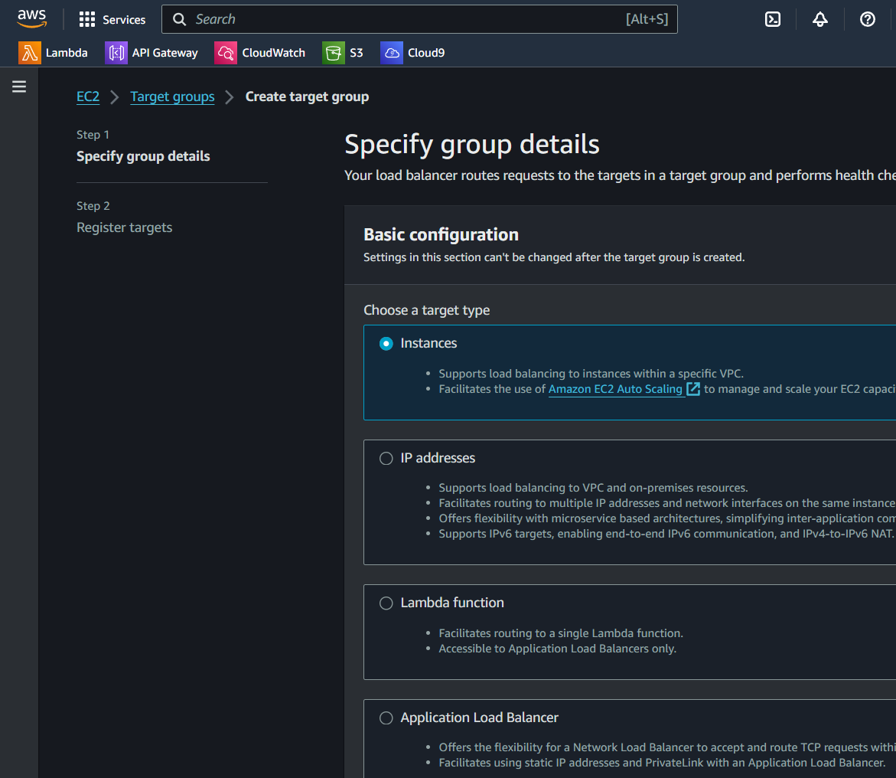
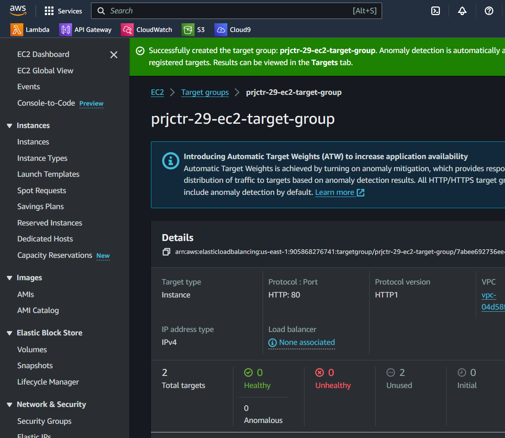
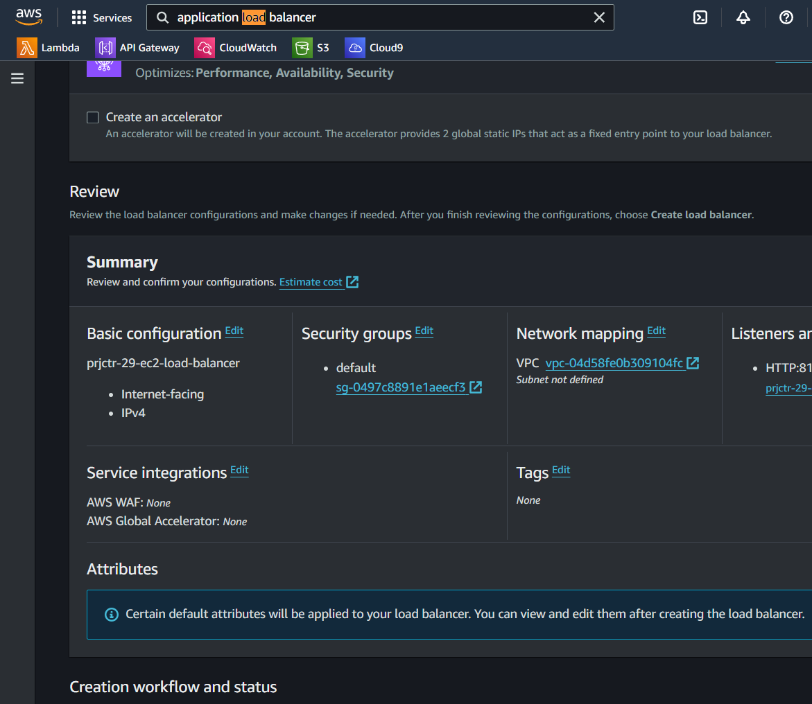
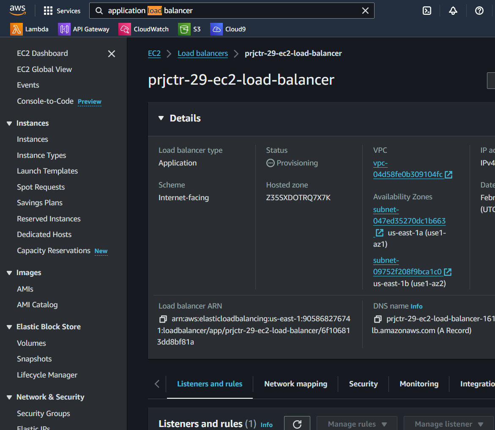

# AWS EC2 Instances with Load Balancer Configuration

## Overview
This project demonstrates how to set up two micro EC2 instances on AWS and distribute incoming traffic between them using a load balancer. This setup ensures high availability and scalability for web applications.

## Prerequisites
- An AWS account
- Basic understanding of AWS EC2 and ELB (Elastic Load Balancing)

## Step-by-Step Guide

### Step 1: Create EC2 Instances
1. Navigate to the EC2 dashboard in the AWS Management Console.
2. Launch two micro instances using the desired AMI (Amazon Machine Image).
3. Configure instance details, add storage, and configure security groups as necessary.

   

### Step 2: Create a Target Group
1. Go to the EC2 service page and select "Load Balancers" from the navigation pane.
2. Under the "Target Groups" section, click "Create target group."
3. Follow the prompts to specify the target type, target group name, and protocol. Then, register the two EC2 instances you created.

   
   

### Step 3: Create and Configure Load Balancer
1. Still within the EC2 service, select "Load Balancers" > "Create Load Balancer."
2. Choose the appropriate load balancer type (e.g., Application Load Balancer).
3. Set up the load balancer settings, including selecting the previously created target group for routing.

   
   

## Usage
After completing the setup, the load balancer will automatically distribute incoming traffic across the two EC2 instances. This setup is suitable for running scalable and highly available web applications.
